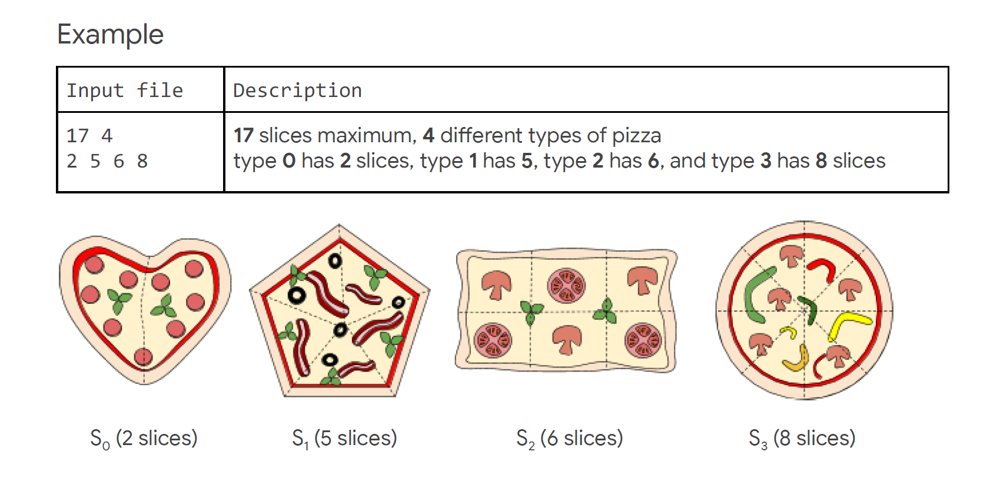

## Google-HashCode-2020

### Solution for the Practice Round of Google Hash Code 2020 - Score: 1,505,004,616
Check the [problem statement](practise-round/practise-problem.pdf)

### How to run the solution ?
- Install Go (https://golang.org/dl/)
- Clone the Repo
- cd practice-round
- go run solution.go a_example.in 